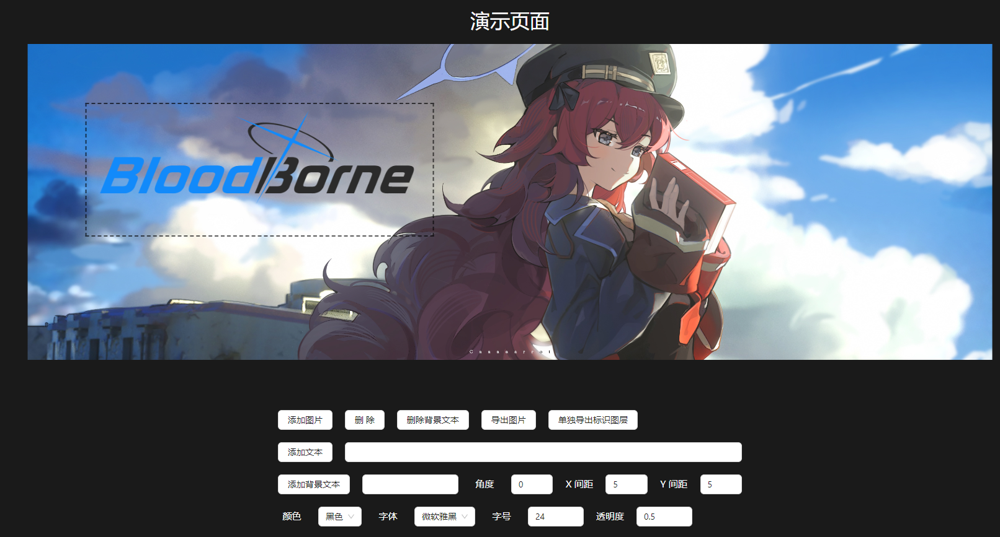

<h1>watermark-layer </h1> 

### 用拖动的方式在页面区域添加 logo 或水印，并可单独导出水印层。
预览地址 : https://watermark-layer.vercel.app/



## 简介

1. 用拖动的方式在页面区域添加 logo 或水印，支持图片、文字、背景文字。
2. 支持单独导出标识图层, 可用于前端预览后端处理 pdf/tiff 等格式的场景, 减少前后端的定位偏差。
3. 可直接导出处理后的图片, 用于简单处理的场景.
4. 图片水印可滚轮调整大小, 其他类型也可通过参数调整.

## 安装

```bash
npm install watermark-layer
or
pnpm install watermark-layer
```

## 使用

```html

<div id="canvas-con">
	
</div>
```

```js
import markRender from 'watermark-layer'

markCon = markRender({
    target: document.querySelector('#canvas-con')
})
```

### 选项

```js
import markRender from 'watermark-layer'

const option = {
    // 需要转换的目标容器 (必需项)
    // 如目标为 img 或其它单标签元素，target 需要选定等宽高的容器元素，类似 cropperjs。
    target: document.querySelector('#canvas-con'),
    activeClass: 'active-class', // 自定义被选中印记的类名 (可选)
    zIndex: 1000, // 容器图层的层级 (可选)
    cancelEvent: false, //是否注销默认默认拖动缩放等事件(可选)
    markClick(index) {// 标识的点击事件 ( 可选)
        i.value = index
    },
    markDrag(index) {// 标识的拖拽事件 ( 可选)
        console.log(index)
    }
}
const style = reactive({ // 可选
    color: 'black', // 文字的字体颜色
    fontSize: 24, // 字号
    fontFamily: '微软雅黑', // 字体
    rotate: 0, // 旋转角度
    opicity: 0.5, // 透明度
    marginTop: 5, // 纵向间距
    marginLeft: 5, // 横向间距
    scale: 1, // 初始缩放比例（图片）
})
document.querySelector('.test-img').addEventListener('load', async () => {
    // 创建编辑图层
    markCon = markRender(option)
    // 添加图片
    markCon.appendMark('logo.png')
    // 添加文字
    markCon.appendText(text.value, style)
    // 添加背景文字
    markCon.appendRepeatText(repeatText.value, style)
    // 导出图片
    await markCon.exportImage()
    // 单独导出标识图层
    await markCon.exportMark()
    // 删除标识
    markCon.deleteMark(index)
})
```
